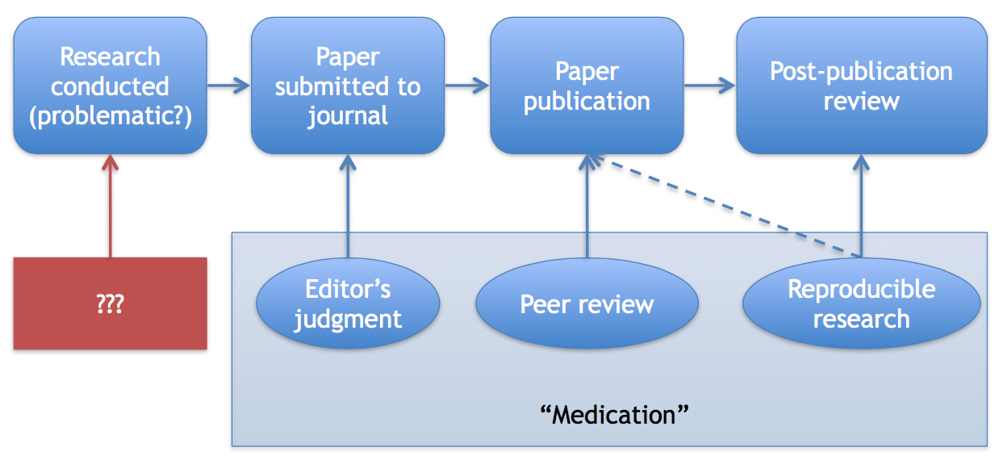
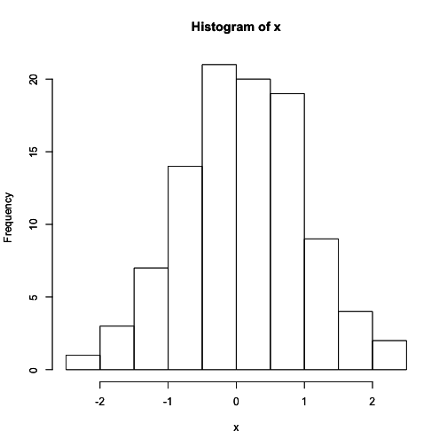
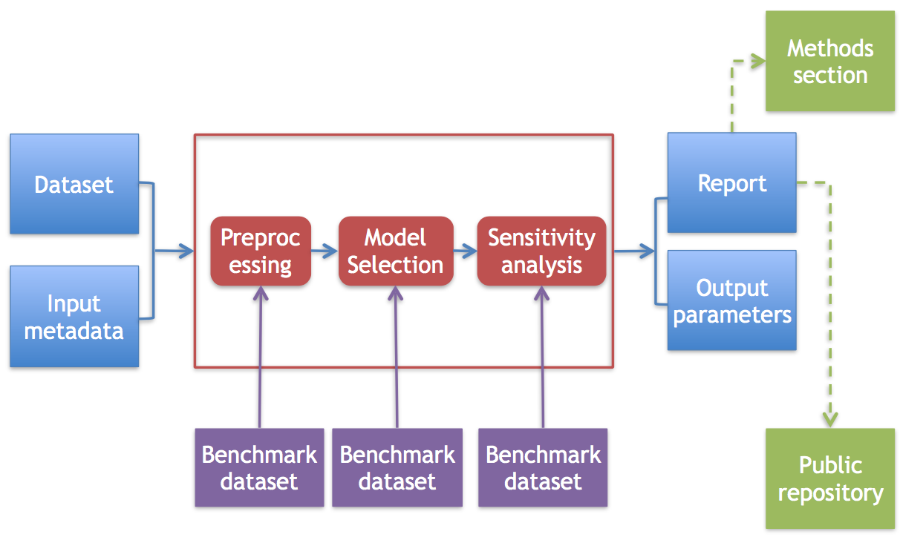

# Evidence-based Data Analysis

*NOTE*: Parts of this chapter were previously published on the [*Simply Statistics*](http://simplystatistics.org) blog.

Watch a video of this chapter: [Part 1](https://www.youtube.com/watch?v=Z792eZcBH3E) [Part 2](https://www.youtube.com/watch?v=_gVgNkHRqu0) [Part 3](https://www.youtube.com/watch?v=mzfVddVcYG0) [Part 4](https://www.youtube.com/watch?v=1r98iJqlJtQ) [Part 5](https://www.youtube.com/watch?v=jFDWhqKjk-o)

Discussions about reproducibility in scientific research have been on the rise lately. The rise in frequency of these discussions was in part a driver for me to write this book. There are many underlying trends that have produced this increased interest in reproducibility: larger and larger studies being harder to replicate independently, cheaper data collection technologies and methods producing larger datasets, cheaper computing power allowing for more sophisticated analyses (even for small datasets), and the rise of general computational science (for every "X" we now have "Computational X").

For those who are skipping around this book, here’s a brief review of what I mean when I say "reproducibility". For the most part in science, we focus on what I and some others call "replication". The purpose of replication is to address the validity of a scientific claim. If I conduct a study and conclude that "X is related to Y", then others may be encouraged to replicate my study--with independent investigators, data collection, instruments, methods, and analysis--in order to determine whether my claim of "X is related to Y" is in fact true. If many scientists replicate the study and come to the same conclusion, then there’s evidence in favor of the claim’s validity. If other scientists cannot replicate the same finding, then one might conclude that the original claim was false. In either case, this is how science has always worked and how it will continue to work.

Reproducibility, on the other hand, focuses on the validity of the data analysis. In the past, when datasets were small and the analyses were fairly straightforward, the idea of being able to reproduce a data analysis was perhaps not that interesting. But now, with computational science and big data, where data analyses can be extraodinarily complicated (and much of the value comes from the analysis), there's great interest in whether certain data analyses can in fact be reproduced. By this I mean is it possible to take someone’s dataset and come to the same numerical/graphical/whatever output that they came to. While this seems theoretically trivial, in practice it’s very complicated because a given data analysis, which typically will involve a long pipeline of analytic operations, may be difficult to keep track of without proper organization, training, or software.

## What Problem Does Reproducibility Solve?

Reproducibility cannot really address the validity of a scientific claim as well as replication. Of course, if a given analysis is not reproducible, that may call into question any conclusions drawn from the analysis. However, if an analysis is reproducible, that says practically nothing about the validity of the conclusion or of the analysis itself.

In fact, there are numerous examples in the literature of analyses that were reproducible but just wrong. Perhaps the most nefarious recent example is the [Potti scandal at Duke](http://simplystatistics.org/2012/02/27/the-duke-saga-starter-set/). Given the amount of effort (somewhere close to 2000 hours) Keith Baggerly and his colleagues had to put into figuring out what Potti and others did, I think it’s reasonable to say that their work was not reproducible. But in the end, Baggerly was able to reproduce some of the results--this was how he was able to figure out that the analysis were incorrect. If the Potti analysis had not been reproducible from the start, it would have been impossible for Baggerly to come up with the laundry list of errors that they made.

The [Reinhart-Rogoff kerfuffle](http://simplystatistics.org/2013/04/19/podcast-7-reinhart-rogoff-reproducibility/) is another example of analysis that ultimately was reproducible but nevertheless questionable. While Thomas Herndon did have to do a little reverse engineering to figure out the original analysis, it was nowhere near the years-long effort of Baggerly and colleagues. However, it was Reinhart-Rogoff’s unconventional weighting scheme (fully reproducible, mind you) that drew all of the negative attention and strongly influenced the analysis.

I think the key question we want to answer when seeing the results of any data analysis is "Can I trust this analysis?" It’s not possible to go into every data analysis and check everything, even if all the data and code were available. In most cases, we want to have a sense that the analysis was done appropriately (if not optimally). I would argue that requiring that analyses be reproducible does not address this key question.

With reproducibility you get a number of important benefits: transparency, data and code for others to analyze, and an increased rate of transfer of knowledge. These are all very important things. Data sharing in particular may be important independent of the need to reproduce a study if others want to aggregate datasets or do combined analyses. But **reproducibility does not guarantee validity or correctness of the analysis**.

## Prevention vs. Medication

One key problem with the notion of reproducibility is the point in the research process at which we can apply it as an intervention. Reproducibility plays a role only in the most downstream aspect of the research process--post-publication. Only after a paper is published (and after any questionable analyses have been conducted) can we check to see if an analysis was reproducible or conducted in error.

At this point it may be difficult to correct any mistakes if they are identified. Grad students have graduated, postdocs have left, people have left the team. In the Potti case, letters to the journal editors were ignored. While it may be better to check the research process at the end rather than to never check it, intervening at the post-publication phase is arguably the most expensive place to do it. At this phase of the research process, you are merely "medicating" the problem, to draw an analogy with chronic diseases. But fundamental data analytic damage may have already been done.

This medication aspect of reproducibility reminds me of a famous quotation from R. A. Fisher:

> To consult the statistician after an experiment is finished is often merely to ask him to conduct a post mortem examination. He can perhaps say what the experiment died of.

Reproducibility allows for the statistician to conduct the post mortem of a data analysis. But wouldn’t it have been better to have prevented the analysis from dying in the first place?

## Moving Upstream

There has already been much discussion of changing the role of reproducibility in the publication/dissemination process. What if a paper had to be deemed reproducible before it was published? The question here is who will reproduce the analysis? We can't trust the authors to do it so we have to get an independent third party. What about peer reviewers? I would argue that this is a pretty big burden to place on a peer reviewer who is already working for free. How about one of the Editors? Well, at the journal *Biostatistics*, that’s exactly what we do. However, our policy is voluntary and only plays a role after a paper has been accepted through the usual peer review process. At any rate, from a business perspective, most journal owners will be reluctant to implement any policy that might reduce the number of submissions to the journal.

## What Then?

To summarize, I believe reproducibility of computational research is very important, primarily to increase transparency and to improve knowledge sharing. However, I don’t think reproducibility in and of itself addresses the fundamental question of "Can I trust this analysis?". Furthermore, reproducibility plays a role at the most downstream part of the research process (post-publication) where it is costliest to fix any mistakes that may be discovered. Ultimately, we need to think beyond reproducibility and to consider developing ways to ensure the quality of data analysis from the start.

How can we address the key problem concerning the validity of a data analysis?

## Towards Evidence-based Data Analysis

Now, it's not true that reproducibility has no value. That’s definitely not true and I’m hoping I can clarify my thinking in this followup post. Having code and data available, importantly, makes it possible to discover problems in an analysis, but only after the fact. I think this results in two issues: (1) It may take a while to figure out what exactly the problems are (even with code/data) and how to fix them; and (2) the problems in the analysis may have already caused some sort of harm.

## Open Source Science?

For the first problem, I think a reasonable analogy for reproducible research is open source software. There the idea is that source code is available for all computer programs so that we can inspect and modify how a program runs. With open source software "all bugs are shallow". But the key here is that as long as all programmers have the requisite tools, they can modify the source code on their own, publish their corrected version (if they are fixing a bug), others can review it and accept or modify, and on and on. All programmers are more or less on the same footing, as long as they have the ability to hack the code. With distributed source code management systems like git, people don’t even need permission to modify the source tree. In this environment, the best idea wins.

The analogy with open source software breaks down a bit with scientific research because not all players are on the same footing. Typically, the original investigator is much better equipped to modify the "source code", in this case the data analysis, and to fix any problems. Some types of analyses may require tremendous resources that are not available to all researchers. Also, it might take a long time for others who were not involved in the research, to fully understand what is going on and how to make reasonable modifications. That may involve, for example, learning the science in the first place, or learning how to program a computer for that matter. So I think making changes to a data analysis and having them accepted is a slow process in science, much more so than with open source software. There are definitely things we can do to improve our ability to make rapid changes/updates, but the implementation of those changes are only just getting started.

## First Do No Harm

The second problem, that some sort of harm may have already occurred before an analysis can be fully examined is an important one. As I mentioned in the previous post, merely stating that an analysis is reproducible doesn’t say a whole lot about whether it was done correctly. In order to verify that, someone knowledgeable has to go into the details and muck around to see what is going on. If someone is not available to do this, then we may never know what actually happened. Meanwhile, the science still stands and others may build off of it.

In the Duke saga, one of the most concerning aspects of the whole story was that some of Potti’s research was going to be used to guide therapy in a clinical trial. The fact that a series of flawed data analyses was going to be used as the basis of choosing what cancer treatments people were going to get was very troubling. In particular, one of these flawed analyses reversed the labeling of the cancer and control cases!

To me, it seems that waiting around for someone like Keith Baggerly to come around and spend close to 2,000 hours reproducing, inspecting, and understanding a series of analyses is not an efficient system. In particular, when actual human lives may be affected, it would be preferable if the analyses were done right in the first place, without the "statistics police" having to come in and check that everything was done properly.

## Evidence-based Data Analysis

What I think the statistical community needs to invest time and energy into is what I call "evidence-based data analysis". What do I mean by this? Most data analyses are not the simple classroom exercises that we’ve all done involving linear regression or two-sample t-tests. Most of the time, you have to obtain the data, clean that data, remove outliers, impute missing values, transform variables and on and on, even before you fit any sort of model. Then there’s model selection, model fitting, diagnostics, sensitivity analysis, and more. So a data analysis is really pipeline of operations where the output of one stage becomes the input of another.

The basic idea behind evidence-based data analysis is that for each stage of that pipeline, we should be using the best method, justified by appropriate statistical research that provides evidence favoring one method over another. If we cannot reasonable agree on a best method for a given stage in the pipeline, then we have a gap that needs to be filled. So we fill it!

Just to clarify things before moving on too far, here’s a simple example.

## Evidence-based Histograms

Consider the following simple histogram.

 

The histogram was created in R by calling `hist(x)` on some Normal random deviates. Now, we all know that a histogram is a kind of smoother, and with any smoother, the critical parameter is the smoothing parameter or the bandwidth. Here, it’s the size of the bin or the number of bins.

Notice that when I call `hist()` I don’t actually specify the number of bins. Why not? Because in R, the default is to use Sturges' formula for the number of bins. Where does that come from? Well, there is a paper in the Journal of the American Statistical Association in 1926 by H. A. Sturges that justifies why such a formula is reasonable for a histogram (it is a very short paper, those were the days). R provides other choices for choosing the number of bins. For example, David Scott wrote a paper in Biometrika that justified bandwith/bin size based in integrated mean squared error criteria.

The point is that R doesn’t just choose the default number of bins willy-nilly, there’s actual research behind that choice and evidence supporting why it’s a good choice. Now, we may not all agree that this default is the best choice at all times, but personally I rarely modify the default number of bins. Usually I just want to get a sense of what the distribution looks like and the default is fine. If there's a problem, transforming the variable somehow often is more productive than modifying the number of bins. What's the best transformation? Well, it turns out there's research on that too.

## Evidence-based Reproducible Research

Now why can’t we extend the idea behind the histogram bandwidth to all data analysis? I think we can. For every stage of a given data analysis pipeline, we can have the "best practices" and back up those practices with statistical research. Of course it’s possible that such best practices have not yet been developed. This is common in emerging areas like genomics where the data collection technology is constantly changing. That’s fine, but in more mature areas, I think it’s possible for the community to agree on a series of practices that work, say, 90% of the time.

There are a few advantages to evidence-based reproducible research.

* It reduces the "researcher degrees of freedom". Researchers would be disincentivized from choosing the method that produces the "best" results if there is already a generally agreed upon approach. If a given data analysis required a different approach, the burden would be on the analyst to justify why a deviation from the generally accepted approach was made.

* The methodology would be transparent because the approach would have been vetted by the community. I call this "transparent box" analysis, as opposed to black box analysis. The analysis would be transparent so you would know exactly what is going on, but it would "locked in a box" so that you couldn't tinker with it to game the results.

* You would not have the lonely data analyst coming up with their own magical method to analyze the data. If a researcher claimed to have conducted an analysis using an evidence-based pipeline, you could at least have a sense that something reasonable was done. You would still need reproducibility to ensure that the researcher was not misrepresenting him/herself, but now we would have two checks on the analysis, not just one.

* Most importantly, evidence-based reproducible research attacks the furthest upstream aspect of the research, which is the analysis itself. It guarantees that generally accepted approaches are used to analyze the data from the very beginning and hopefully prevents problems from occurring rather than letting them propagate through the system.

## Evidence-based Data Analysis in Practice

How can we implement evidence-based data analysis in practice? Depending on your favorite  software system you could imagine a number of ways to do this. If the pipeline were implemented in R, you could imagine it as an R package. The precise platform is not critical at this point; I would imagine most complex pipelines would involve multiple different software systems tied together.

Below is a rough diagram of how I think the various pieces of an evidence-based data analysis pipeline would fit together.

There are a few key elements of this diagram that I'd like to stress:

* Inputs are minimal. You don't want to allow for a lot of inputs or arguments that can be fiddled with. This reduces the number of degrees of freedom and hopefully reduces the amount of hacking. Basically, you want to be able to input the data and perhaps some metadata.

* Analysis comes in stages. There are multiple stages in any analysis, not just the part where you fit a model. Everything is important and every stage should use the best available method.

* The stuff in the red box does not involve manual intervention. The point is to not allow tweaking, fudging, and fiddling. Once the data goes in, we just wait for something to come out the other end.

* Methods should be benchmarked. For each stage of the analysis, there is a set of methods that are applied. These methods should, at a minimum, be benchmarked via a standard group of datasets. That way, if another method comes a long, we have an objective way to evaluate whether the new method is better than the older methods. New methods that improve on the benchmarks can replace the existing methods in the pipeline.

* Output includes a human-readable report. This report summarizes what the analysis was and what the results were (including results of any sensitivity analysis). The material in this report could be included in the "Methods" section of a paper and perhaps in the "Results" or "Supplementary Materials". The goal would be to allow someone who was not intimately familiar with the all of the methods used in the pipeline to be able to walk away with a report that he/she could understand and interpret. At a minimum, this person could take the report and share it with their local statistician for help with interpretation.

* There is a defined set of output parameters. Each analysis pipeline should, in a sense, have an "API" so that we know what outputs to expect (not the exact values, of course, but what kinds of values). For example, if a pipeline fits a regression model at the end the regression parameters are the key objects of interest, then the output could be defined as a vector of regression parameters. There are two reasons to have this: (1) the outputs, if the pipeline is deterministic, could be used for regression testing in case the pipeline is modified; and (2) the outputs could serve as inputs into another pipeline or algorithm.

Clearly, one pipeline is not enough. We need many of them for different problems. So what do we do with all of them?

I think we could organize them in a central location (kind of a specialized GitHub) where people could search for, download, create, and contribute to existing data analysis pipelines. An analogy (but not exactly a model) is the Cochrane Collaboration which serves as a repository for evidence-based medicine. There are already a number of initiatives along these lines, such as the Galaxy Project for bioinformatics. I don't know whether it'd be ideal to have everything in one place or have a number of sub-projects for specialized areas.

Each pipeline would have a leader (or "friendly dictator") who would organize the contributions and determine which components would go where. This could obviously be contentious, more some in some areas than in others, but I don't think any more contentious than your average open source project (check the archives of the Linus Kernel or Git mailing lists and you'll see what I mean).

## Summary

To summarize, I think we need to organize lots of evidence-based data analysis pipelines and make them widely available. If I were writing this 5 or 6 years ago, I'd be complaining about a lack of infrastructure out there to support this. But nowadays, I think we have pretty much everything we need in terms of infrastructure. So what are we waiting for?

