# Using `knitr` for Reproducible Reports

There are a number of challenges to making reproducible report writing a reality. Authors must undertake considerable effort to put data and results on the web or at least to make them available to a wide audience. Readers must download those data and results individually and piece together which data go with which code sections. Often both authors and readers must manually interact with websites, in a highly non-automated process. Finally, there is often no single document to integrate data analysis with textual representations, so the data, code, and text are not linked together in a coherent manner.

A general solution that attempts to address some of these challenges is literate statistical programming, a concept we introduced earlier in this book. For those of you who are skipping around, the idea of literate programming comes from Donald Knuth, who envisioned computer code and the documentation for that code existing together in a single document. 

For literate *statistical* programming, the idea is that a report is viewed as a stream of text and code. Analysis code is divided into code chunks with text surrounding the code chunks explaining what is going on. In general, literate programs are *weaved* to produce human-readable documents and *tangled* to produce machine- readable documents

The requirements for writing literate programs are a **documentation language** and a **programming language**. Knuth's original WEB system used TeX as the documentation language and Pascal as the programming language. Fritz Leisch originally developed the Sweave system for R, which used LaTeX as the documentation language and R as the programming language. This system was very powerful, and quite useful for those mathematically and statistically inclined users for whom LaTeX was a commonly used markup language. However, the requirement to learn LaTeX was a high barrier for mamy people, higher even than learning R, if only because people saw few benefits to learning LaTeX except to use a system like Sweave. Sweave still comes with every R installation and is maintained by the R Core members.

## Literate Statistical Programming: Pros and Cons

Before we go on to the details of using `knitr` for reproducible reports, we should note that there are both advantages and disadvantages to using a literate programming system for writing reports. Some of the advantages are that 

* Text and code are all in one place and placed in a logical order as dictated by the flow of the data analysis

* Results are automatically updated to reflect external changes to data, code, etc.

* Code is live; this helps to serve as a built in regression test when building a document---if you can't run the code, you can't build the document.

On the other hand, there are some disadvantages:

*  Text and code all in one place! This can sometimes make documents difficult to read, especially if there is _a lot_ of code. It might make sense to place code in a separate file, but they you are introducing more complexity and more chances for non-reproducibility.

* The processing of documents can be very slow, especially if the document is long. However, there are now tools that can help with that (somewhat). In general, literate statistical programming tools are awkward to use for very long or very complex documents. In those cases, it's better to use literate programming tools in conjunction with other tools, like Makefiles.

My general feeling is that `knitr` is ideal for

*  Manuals
*  Short/medium-length technical documents 
*  Tutorials
*  Reports, especially if they will be generated periodically with updated data
*  Data preprocessing documents and summaries

I feel that `knitr` is NOT particularly well-suited for the following:

*  Very long research articles
*  Documenting very complex and time-consuming computations
*  Documents that require precise formatting (although this is more an issue with using Markdown than it is with using `knitr`)


## The `knitr` Packages

The `knitr` package was developed by [Yihui Xie](http://yihui.name), while he was a graduate student at Iowa State University. The `knitr` package many of the ideas that had been developed in separate packages since the introduction of Sweave and combined them all together into one logical package/framework. The package supports a variety of documentation languages (Markdown, LaTeX, and HTML) and a variety of programming languages. The package also supports weaving to PDF and HTML formats (in RStudio you can also weave to Microsoft Word docx format). For the purposes of this book, we will focus on using Markdown as the documentation language and R as the programming language and assume you are exporting to HTML format.

The `knitr` package is available from your local CRAN mirror and can be installed with the `install.packages()` function in R. One key feature of the RStudio IDE (among many) is that `knitr` is built right into the GUI so that you can write documents with `knitr` without having to write at the console.

To use the `knitr` package, you need

*  A recent version of R
*  A text editor for writing R Markdown documents (the one that comes with RStudio is fine)
*  Some support packages installed (also available on CRAN)
*  Some knowledge of Markdown, LaTeX, or HTML

As noted above, we will focus on using Markdown here.


## My First `knitr` Document

Here's an example of creating a simple R Markdown document in RStudio. To create a new document, you can click on the menu in the upper left hand side of the GUI.

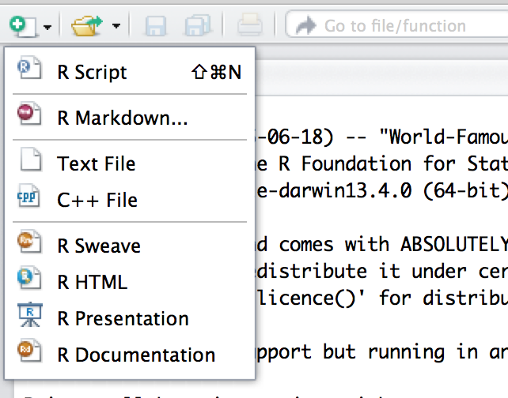

RStudio will prompt you with a dialog box to set some of the metadata for the document. You can feel free to either fill this out now or just click OK. Either way, you can always make changes to this information later.


Initially, RStudio creates the R Markdown document with some filler text. Don't worry about this text, you can feel free to delete later it when you're ready to write your document. However, if you're new to R Markdown, you might want to take a look at it to get a feel of how R Markdown documents are written.

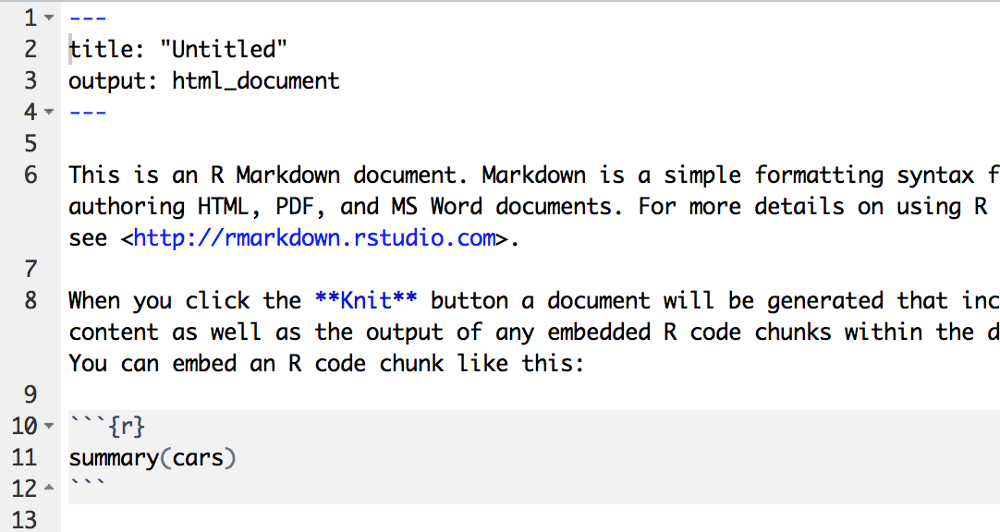


## Processing an R Markdown Document

When you are ready to process and view your R Markdown document the easiest thing to do is click on the `Knit HTML` button that appears at the top of the editor window. For now, just leave the boiler

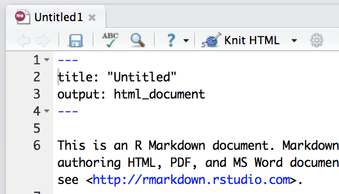


If you're not using RStudio, you can still process R Markdown documents with the `knitr` package directly. Assuming your R Markdown document is in your current working directory (as determined by `getwd()`) you can run


~~~~~~~~
library(knitr)
knit2html("document.Rmd")
browseURL("document.html")
~~~~~~~~

where `document.Rmd` and `document.html` should be substituted with whatever your file name happens to be.

## HTML Output

When you click the `Knit HTML` button (or run the `knit2html()` function) the result you get should look something like this.

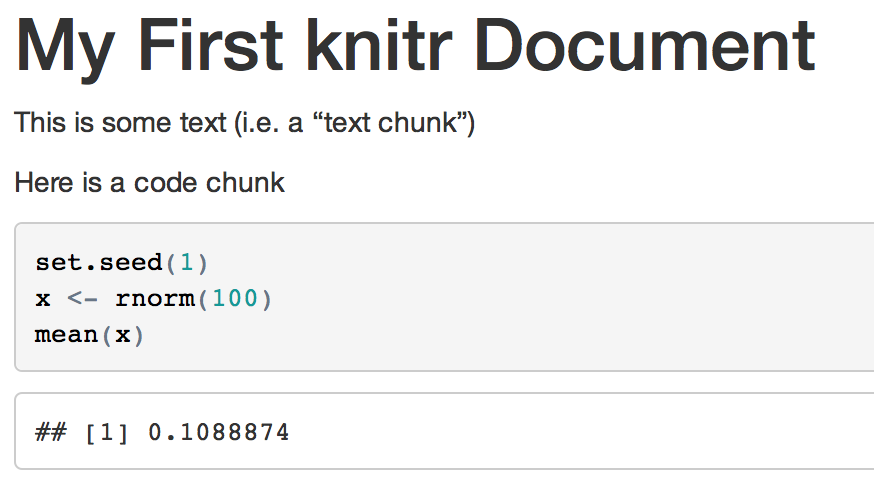

Note here that the the code is echoed in the document in a grey background box and the output is shown just below it in a white background box. This is the default theme for the output in RStudio. For better or for worse, `knitr` produces (by default) a standalone HTML document with the styling information built in to the document.

Notice also that the output is prepended with two pound symbols. This is there so that if you happen to be copying code from the HTML output and pasting it into the R console, you just copy and paste the code and don't accidently paste the output too (the output will be commented out in the R console). You can turn this behavior off by setting


~~~~~~~~
knitr::opts_chunk$set(comment = NA)
~~~~~~~~

at the top of your document somewhere (see below for setting global options).


## A Few Notes

There are a couple of things worth noting at this point. First, as you already saw, opening a new R Markdown document in RStudio will fill a new document with filler text. Just delete the filler; it's just there to demonstrate the basics of R Markdown documents.

Code chunks begin with ```` ```{r} ```` and end with just ```` ``` ````. Any R code that you include in a document must be contained within these delimiters, unless you have inline code. Code chunks can have names, which is useful when we start incorporating graphics (graphics file names are based on the code chunk name). Finally, by default, code in a code chunk is echoed back out to the document, as will the results of the computation (if there are results to print).

When you process a knitr document here's what happens under the hood:

1.  You write the RMarkdown document (with a `.Rmd` extension)
2. `knitr` produces a Markdown document (with a `.md` extension)
3. `knitr` converts the Markdown document into HTML (by default)

The process is  `.Rmd` to `.md` to `.html`; in principle there should be three documents when the process is complete, but RStudio deletes the intermediary `.md` file by default (you can turn this behavior off if you need the `.md` file)

You should NOT edit (or even save) the `.md` or `.html` documents until you are finished; these documents will be overwritten the next time you knit the `.Rmd` file.


## Another Example

Here's an example of an R Markdown document where we modify some of the chunk-level arguments to override the defaults. In this case, we choose to NOT echo the code in the resulting document. This sometimes useful if there's just too much code and you don't want to overwhelm the reader with a print out of the code.

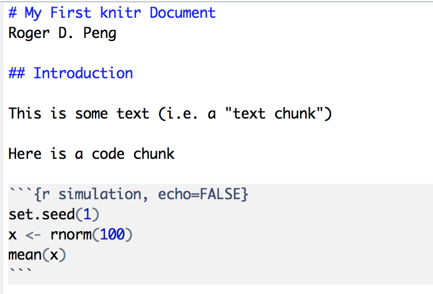

And here is the output.

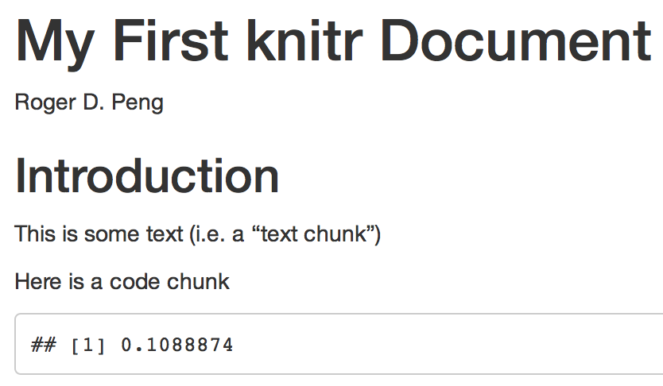

Notice that now the code is no longer in the document.


## Hiding Results

In addition to hiding the code, you can hide the results of computation. This is sometimes useful if you are, for example, making a plot and you want the reader to see the final plot, not the various results of the computations that came before it. Setting the option `results = "hide"` achieves this.


The following output now hides both the code and the results of the code.

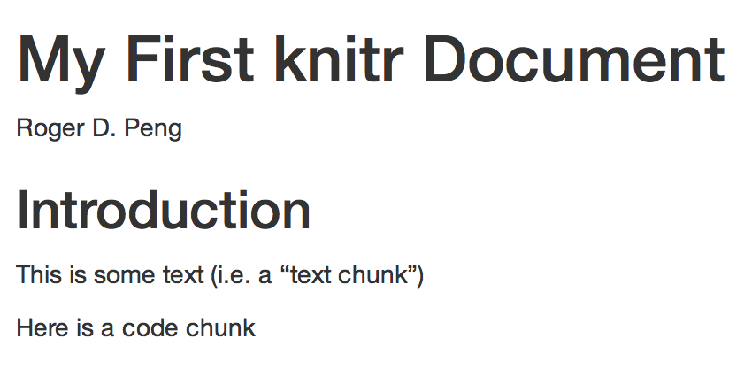


## Inline Computations

Occasionally, it's useful to put some computations within a sentence. For example, you may be quoting a specific numerical results in the middle of a paragraph. Rather than try to copy and paste the result into the paragraph, it's better to just do the computation right there in the text.

In this example I'm quoting the current time and generating a random Normal variate as my "favorite" number.

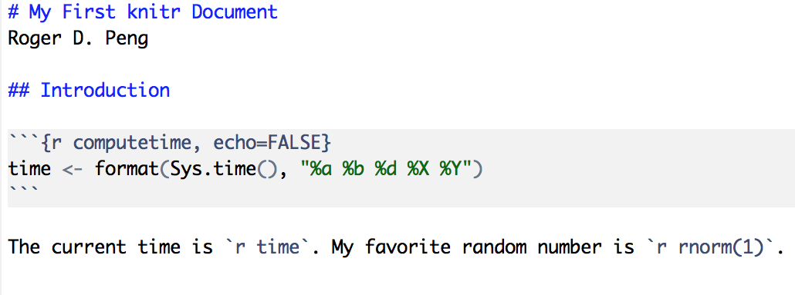

Here is the output from the above source. Notice that the current time is inserted into the text, as well as a random number.

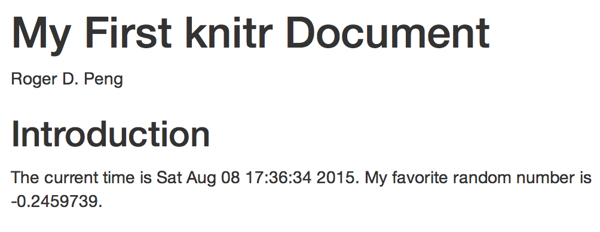


## Incorporating Graphics

No report of a data analysis would be complete without some sort of graphic or plot, right? Of course, incorporating data graphics with `knitr` is straightforward. By default, nothing special needs to be done. You can just put the plotting code in a code chunk and the plot will be inserted into the resulting HTML document.

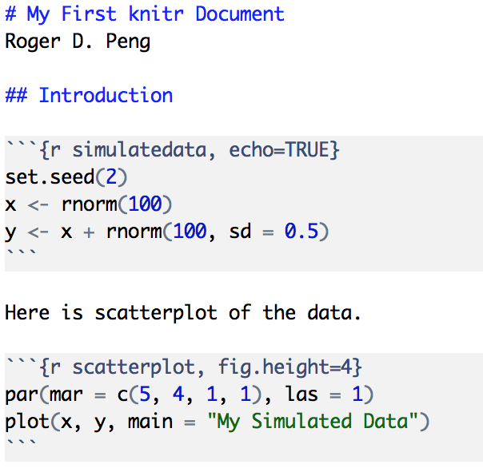

In the example above, I decided to change the figure height to make it a bit shorter than the default. You can change the width of the plot with the `fig.width` argument in the code chunk.

When `knitr` creates the HTML document, by default, it embeds the figure into the HTML document as base 64 encoded string. You can see that here in the HTML below.

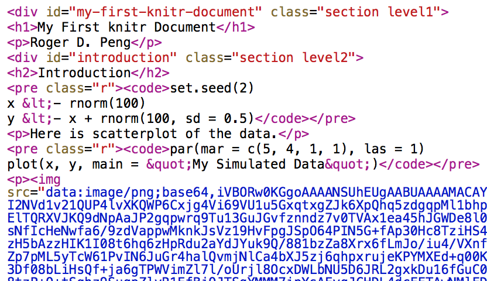

This is useful sometimes because it makes the resulting HTML document stand alone. You can email it to a colleague and they will be able to view it without having to worry about any external dependencies like image files. However, it does make the resulting HTML much larger than it needs to be (and make sit totally unreadable). That said, given that the HTML is not meant to be read directly and is just auto-generated by `knitr`, it's not clear that there are many downsides to this approach.

Here's the actual output that gets rendered in the HTML viewer (or web browser).

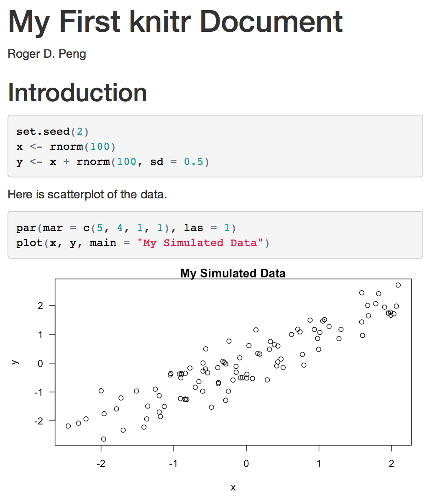


## Making Tables With `xtable`

Tables can be made in R Markdown documents with the help of the `xtable` package. Tables can be notoriously non-reproducible if they are made by hand. Luckly, the `xtable` package can take tabular information and format it nicely in either HTML or LaTeX. Here, we will create HTML tables.

In the code below, we fit a multiple linear regression model and then create a table of the regression coefficients. Essentially, this is the output that is generated by the `summary()` function when called on `lm` objects.


Notice that in the chunk options I specify `results="asis"`. This is because `xtable` generates its own HTML output, so it doesn't have to be subsequently converted into HTML by `knitr`. 

The output document is below.

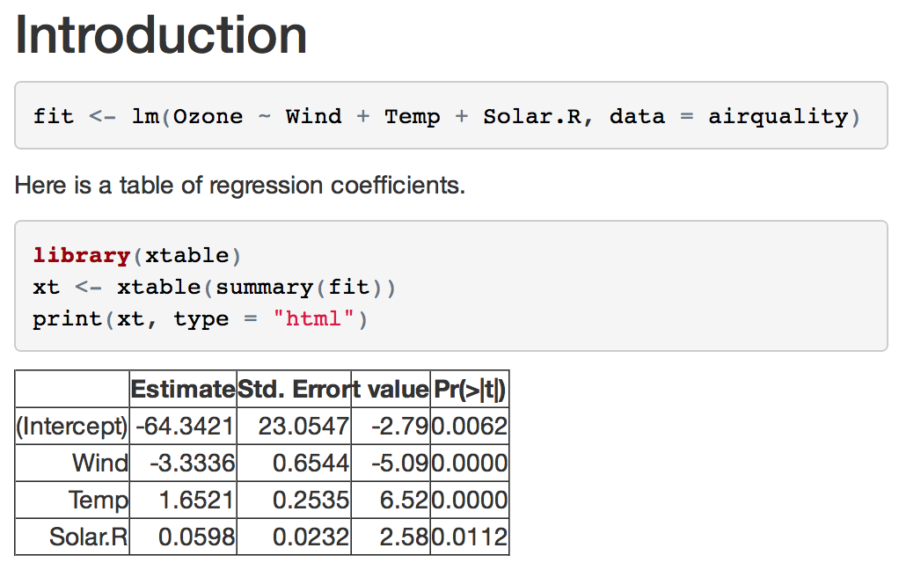

This is just one simple example of how `xtable` can be used to generate HTML tables. There are many other options that can be configured in the `print()` method for `xtable` objects and the help page is worth exploring.


## Setting Global Options

Sometimes you want to set an option that applies to all chunks in your document. This can be done by modifying the `opts_chunk` variable in `knitr`, which is a global variable in the `knitr` package. Usually, this is done by creating a code chunk somewhere in the beginning of the document (before any other code chunks in the document) and modifying the `opts_chunk` object. 

For example, if we wanted the default to be that all chunks do NOT echo their code and always hide their results, we could set


~~~~~~~~
knitr::opts_chunk$set(echo = FALSE, results = "hide")
~~~~~~~~

Any other valid chunk options can be set in the embedded `set()` function in the `opts_chunk` object.

Global options can always be overridden by any specific options that are set in at the chunk level. For example, when using the `xtable` package, I want to override the default `results` argument.

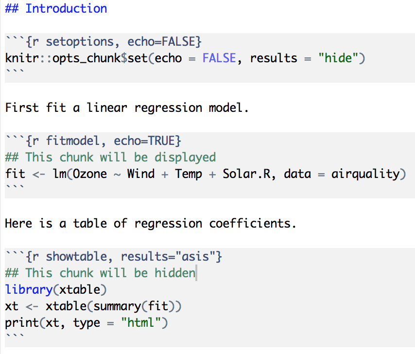

Here is the corresponding output.

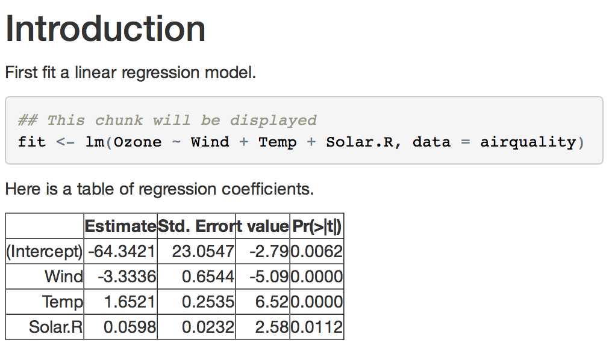


## Caching Computations

Earlier in this chapter, I mentioned that `knitr` is perhaps not so useful if you are writing a very long document or one involving complex computations. However, there is one tool that can be useful and may help you circumvent some of these problems.

The basic issue is that if you have a long document or one involving lengthy computations, then every time you want to view your document in the pretty formatted version, you need to re-compile the document, meaning you need to re-run all the computations. If your code chunks are quick and not too numerous, the having to knit the document every time is not such a burden. But otherwise, it can be painful to have to sit there and wait for every computation to run every single time. 

Chunk caching is one way to avoid these lengthy computations. By setting the `cache = TRUE` chunk option, what `knitr` does is run the chunk *once*, then store the output in a database in your working directory. Then, when you re-knit the document, instead of running the code in that particular chunk, `knitr` simply re-loads the stored output from the database. It's kind of like a chunk-level version of memoization. However, if the code in the chunk changes at all, `knitr` can detect this and will re-run the code (and store the reuslts again). 


There some caveats to caching. In particular, by default dependencies between chunks are not checked. If the results of a cached chunk depend on a previous chunk that has been modified, those changes will not necessarily propogate down to later cached chunks. Also, chunks with significant side effects, such as those writing output to files or interacting with the external environment in any way, may not be cacheable.


## Summary

Literate statistical programming can be a useful way to put text, code, data, and output all in one document. Doing this with R and Markdown, in conjuncdtion with the `knitr` package and RStudio, is an very easy and yet powerful tool for integrating code and text in a simple document format.


