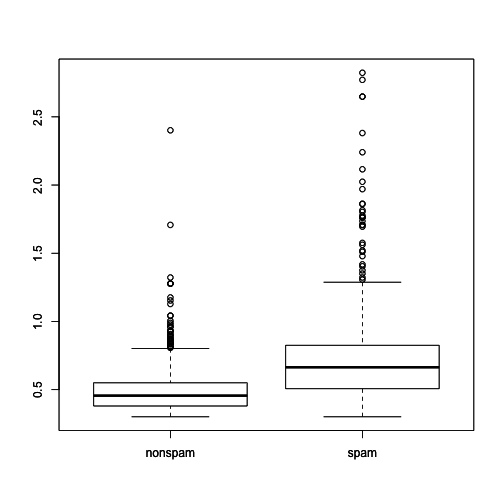
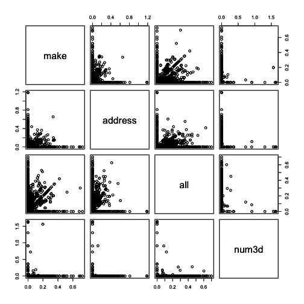
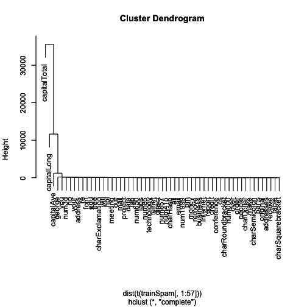
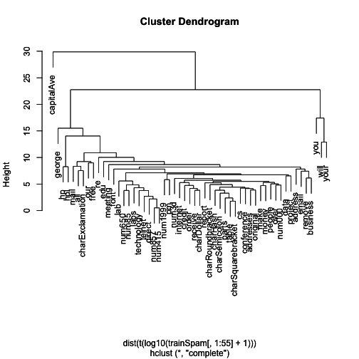

# Structure of a Data Analysis: Part 1

This chapter will talk about the basic process by which data analysis will unfold. Of course, not every data analysis is the same and not every data analysis will require the same components. But I think this will serve as a useful template for understanding what the pieces of a data analysis are and how they typically flow together. If one were to write down the steps in a data analysis, you might come up with something along these lines of the following list 

* Defining the question

* Defining the ideal dataset

* Determining what data you can access

* Obtaining the data

* Cleaning the data

* Exploratory data analysis

* Statistical prediction/modeling

* Interpretation of results

* Challenging of results

* Synthesis and write up

* Creating reproducible code

There may be little things that you might want to add or delete, but most data analyses have some subset of these steps. 

What we're going to talk about in this chapter, Part 1, is defining the question that you're interested in, the ideal data set, determining what data you actually can access, and obtaining and cleaning the data. In the next chapter we'll talk about the remaining topics listed here.

I think the key challenge in pretty much any data analysis was well characterized by Dan Meyer, a former high school mathematics educator. In his TED Talk he said, "Ask yourselves what problem you have ever solved, that was worth solving, where you knew all the given information in advance, where you didn't have a surplus of information and have to filter it out, or you had insufficient information and had to go find some." That's a key element of data analysis; typically, you don't have all the facts or you have too much information and you have to go through it. Much of the process of data analysis is sorting through all of this stuff. So, the first part of data analysis that you want to start with is defining a question.

## The Question

Not every data analysis starts with a very specific or coherent question. But the more effort you can put into coming up with a reasonable question, the less effort you'll spend having to filter through a lot of stuff. Because **defining a question is the most powerful dimension reduction tool you can ever employ**. If you're interested in a specific variable, like height or weight, then you can remove a lot of other variables that don't really pertain to those criteria at all. But if you're interested in a different type of variable then you can remove another subset. The idea is, if you can narrow down your question as specifically as possible, you'll reduce the kind of noise that you'll have to deal with when you're going through a potentially very large data set. Now, sometimes you only want to look at a data set and see what is inside of the data set. Then you'll have to explore all kinds of things in a large data set. But if you can narrow down your interest to a specific type of question, it is extremely useful for simplifying your problem. 

I encourage you to think about what type of question you're interested in answering *before* you go delving into all the details of your data set. The science, generally speaking, will determine what type of question you're interested in asking. That will lead you to the data. Which may lead you to applied statistics, which you use to analyze the data. If you get really ambitious you might want to think of some theoretical statistics that will generalize the methods that you apply to different types of data. Now, of course, there are relatively few people who can do that, and so I it would not be expected of everyone.

A key problem is if you randomly apply statistical methods to datasets to find an interesting answer you will almost certainly find something interesting, but it may not be reproducible and it may not be really meaningful. A proper data analysis has a scientific context, and at least some general question that we're trying to investigate which will narrow down the kind of dimensionality of the problem. Then we'll apply the appropriate statistical methods to the appropriate data.

Let's start with the very basic example of a question. A general question might be: can I automatically detect emails that are spam and those that are not? Of course, this is an important question if you use email and you want to know which emails you should read, that are important, and which emails are just spam. If you want to turn that into a data analysis problem there are many ways to answer the question. For example, you could hire someone to go through your email and figure out what's spam and what’s not. But that's not really sustainable, and it's not particularly efficient. So, if you want to turn this into a data analysis question, you have to make the question a little bit more concrete and translate it using terms that are specific to data analysis tools. 

A more concrete version of this question might be: can I use quantitative characteristics of the emails themselves to classify them as spam? Now we can start looking at emails and try to identify these quantitative characteristics that I want to develop so that I can classify them as spam. You've got a question, "How do I separate out my email so that I know what's spam and what's not?" Ultimately, you can get rid of all the spam and just read the real email.

## The Ideal Dataset

The first thing you might want to think about is what is the ideal data set for this problem? If I had all the resources in the world, what would I go out to look for? There are different types of data sets that you could potentially collect depending on the goal and the type of question you're asking. 

If you're interested in a descriptive problem, you might think of a whole population. You don't need to sample anything. You might want to get the entire census or population that you're looking for. So all the emails in the universe, for example. If you just want to explore your question, you might take a random sample with a bunch of variables measured. 

If you want to make inference about a problem then you have to be very careful about the sampling mechanism and the definition of the population that you are sampling from. Typically, when you make an inferential statement, you use your smaller sample to make a conclusion about a larger population. Therefore, the sampling mechanism is very important. If you want to make a prediction, you need something like a training set and a test data set from a population that you're interested in so that you can build a model and a classifier. 

If you want to make a causal statement, such as "if I modify this component, then something else happens," you're going to need experimental data. One type of experimental data is from something like a randomized trial or a randomized study. If you want to make mechanistic types of statements, you need data about all the different components of the system that you're trying to describe.

For our problem with spam, perhaps you use Gmail. You know that all the emails in the Gmail system are going to be stored on Google's data centers. Why don't we just get all the data (emails) in Google's data centers? That would be a whole *population* of emails. Then we can just build our classifier based on all this data and we wouldn't have to worry about sampling because we'd have all the data. That would be an example of an ideal data set. 

Of course, in the real world, you have to think about what data you can actually access, right? Maybe someone at Google can actually access all the emails that go through Gmail, but even in that extreme case, it may be difficult. Furthermore, most people are not going to be able to access that. So, sometimes you have to go for something that is not quite the ideal data set. You might be able to find free data on the web. You might need to buy some data from a provider, being sure to respect the terms of use for the data. Any agreement or contract that you agree to about the data has to be adhered to. If the data simply does not exist out there, you may need to generate the data yourself in some way.

## The Real Dataset

Getting all the data from Google will probably not be possible. I'm guessing their data centers have some very high security, so we're going to have to go with something else. One possible solution comes from the UCI machine learning repository, which is the spam data set. This is a collection of spam in a data set created by people at Hewlett Packard who collected several thousand spam and regular messages, then classified them appropriately. You can use this database to explore your problem of how to classify emails into spam. When you obtain the data, the first goal is to try to obtain the raw data. For example, from the UCI machine learning repository. 

You have to be careful to reference the source, so wherever you get the data from, you should always reference and keep track of where it came from. If you need to get data from a person or an investigator that you're not familiar with, often a very polite email will go a long way. They may be willing to share that data with you. If you get data from an Internet source, you should always make sure at the very minimum to record the URL, which is the web site indicator of where you got the data, and the time and date that you accessed it so people have a reference of when that data was available. In the future, the website might go down or the URL may change or may not be available, but at least at the time you got that data you documented how you got it.

## Cleaning the Data

The data set that we're going to talk about in this example, since we don't have access to Google's data centers, is the spam data set which you can get from the `kernlab` package in R. If you install the kernlab package, you can load the data set right away. The first thing that you typically need to do with any data set is to clean it a little bit. Raw data typically needs to be processed in some way to get it into a form where you can model it or feed it into a modeling program. 

If the data is already pre-processed, it's important that you understand how it was done. Try to get some documentation about what the pre-processing was and how it was done. You have to understand kind of where the data come from, so for example if it came from a survey, you need to know how the sampling was done. Was it a convenience sample, or did the data come from an observational study, or perhaps from experiments? The source of the data is very important. You may need to reformat the data in a certain way to get it to work in a certain type of analysis. If the data set is extremely large you may want to sub-sample the data set to make it more manageable.

It is very important that anything you do to clean the data is recorded. Write down these steps in scripts or whatever is most convenient because you or someone else is going to have to reproduce these steps if they want to reproduce your findings. If you don't document all these pre-processing steps, then no one will ever be able to do it again. 

Once you have cleaned the data and you have gotten a basic look at it, it is important to *determine if the data are good enough to solve your problems*. In some cases, you may determine that the data are not good enough. For example, you may not have enough data, you may not have enough variables or enough characteristics, or the sampling of the data may be inappropriate for your question. There may be all kinds of problems that occur to you as you clean the data. 

If you determine the data are not good enough for your question, then you've got to quit, try again, change the data, or try a different question. It is important to not simply push on with the data you have, just because that's all that you've got, because that can lead to inappropriate inferences or conclusions. 

Here is our cleaned data set from the `kernlab` package that we're going to use for this example. It's already been cleaned for us, in the kernlab package, and I'm just showing you the first five variables here. There are many other variables in the data set but you can see that there are 4601 observations of the five variables. You can learn more about the dataset [here](http://search.r-project.org/library/kernlab/html/spam.html), where it shows you where the data set came from and how it's processed.

~~~~~~~~
library(kernlab)
data(spam)
str(spam[, 1:5])
~~~~~~~~

~~~~~~~~
'data.frame':	4601 obs. of  5 variables:
 $ make   : num  0 0.21 0.06 0 0 0 0 0 0.15 0.06 ...
 $ address: num  0.64 0.28 0 0 0 0 0 0 0 0.12 ...
 $ all    : num  0.64 0.5 0.71 0 0 0 0 0 0.46 0.77 ...
 $ num3d  : num  0 0 0 0 0 0 0 0 0 0 ...
 $ our    : num  0.32 0.14 1.23 0.63 0.63 1.85 1.92 1.88 0.61 0.19 ...
~~~~~~~~

Note if the `kernlab` package isn't installed, you can install it from CRAN using the `install.packages()` function.

# Structure of a Data Analysis: Part 2

Jumping off from the previous chapter, we can define some further steps in a data analysis to be

* Exploratory data analysis

* Statistical prediction/modeling

* Interpretation of results

* Challenging of results

* Synthesis and write up

* Creating reproducible code

Understanding each of these steps and documenting them carefully through scripts and other tools is essential for reproducibility. 

In this chapter, we're going to continue the data analysis example that we started in part one. If you recall, we laid down a list of steps that generally one might take when doing a data analysis. And previously we talked about the first roughly half of these steps. In this chapter, we're going to talk about the remaining half. This includes exploratory data analysis, statistical prediction and modeling, interpretation, challenging your results, synthesizing and writing up the results, and creating reproducible code.

The basic question was, can I automatically detect emails that are SPAM or not? And a slightly more concrete version of this question that can be used to translate into a Cisco problem was, can I use quantitative characteristics of the emails to classify them as SPAM or HAM? 

## Splitting the Dataset

Our data set, again, was f=rom this UCI Machine Learning Repository, which had already been cleaned up, and it was available in the current lab package as a data set. This data set had 4,600 observations or emails that had been kind of characterized along 58 different variables. So, the first thing that we need to do with this data set if we want to build a model to classify emails into spam or not, is that we need to split the data set into test set and a training set. The idea is that we're going to use part of the test of the data set to build our model, and then we're going to use another part of the data set which is independent of the first part to actually determine how good our model is kind of making a prediction.

~~~~~~~~
library(kernlab)
data(spam)

## Perform the subsampling
set.seed(3435)
trainIndicator = rbinom(4601, size = 1, prob = 0.5)
table(trainIndicator)
~~~~~~~~

~~~~~~~~
trainIndicator
   0    1 
2314 2287 
~~~~~~~~

Here I'm a taking a random half of the data set, so I'm flipping a coin with the rbinom() function, to generate a random kind of coin flip with probability of half, so that'll separate the the data set into two pieces. You can see that roughly 2000, about 2314, are going to be in one half and 2287 will be in the other half. And so the training set will be one set and the test set will be another set of data.

~~~~~~~~
trainSpam = spam[trainIndicator == 1, ]
testSpam = spam[trainIndicator == 0, ]
~~~~~~~~

## Exploratory Data Analysis

The first thing we're going to want to do is a little bit of exploratory data analysis. Given that we have not looked at this data set yet, it would be useful to look at what are the data, what did the data look like, what's the distribution of the data, what are the relationships between the variables. We want to look at basic summaries, one dimensional, two dimensional summaries of the data and we want to check for is there any missing data, why is there missing data, if there is, create some exploratory plots and do a little exploratory analyses.

If we look at the training data sets, that's what we're going to focus on right now as we do our exploratory analysis and as we build our model, all that's going to be done in the training data set. And if you look at the column names of the dataset, you can see that they're all just words essentially.

~~~~~~~~
head(names(trainSpam), 20)
~~~~~~~~

~~~~~~~~
 [1] "make"      "address"   "all"       "num3d"     "our"      
 [6] "over"      "remove"    "internet"  "order"     "mail"     
[11] "receive"   "will"      "people"    "report"    "addresses"
[16] "free"      "business"  "email"     "you"       "credit"   
~~~~~~~~

If you look at the first five rows, we can see that basically these are the frequencies at which they occur in a given email.

~~~~~~~~
head(trainSpam[, 1:10])
~~~~~~~~

~~~~~~~~
   make address  all num3d  our over remove internet order mail
1  0.00    0.64 0.64     0 0.32 0.00   0.00        0  0.00 0.00
7  0.00    0.00 0.00     0 1.92 0.00   0.00        0  0.00 0.64
9  0.15    0.00 0.46     0 0.61 0.00   0.30        0  0.92 0.76
12 0.00    0.00 0.25     0 0.38 0.25   0.25        0  0.00 0.00
14 0.00    0.00 0.00     0 0.90 0.00   0.90        0  0.00 0.90
16 0.00    0.42 0.42     0 1.27 0.00   0.42        0  0.00 1.27
~~~~~~~~

You can see the word "make" does not appear in that first email and, and the word "mail" does not appear. These are all basically frequency counts, or frequencies of words within each of the emails. If we look at the training data set and look at the outcome, we see that 906 of the emails are spam, are classified as spam.

~~~~~~~~
table(trainSpam$type)
~~~~~~~~

~~~~~~~~

nonspam    spam 
   1381     906 
~~~~~~~~

And the other 1381 are classified as non-spam. This is what we're going to use to build our model for predicting the spam emails. We can make some plots and we can compare, what are the frequencies of certain characteristics between the spam and the non spam emails.
	
Here we're looking at a variable called `capitalAve`, the average number of capital letters. 

~~~~~~~~
boxplot(capitalAve ~ type, data = trainSpam)
~~~~~~~~

 

And, you can see that it’s difficult to look at this picture, because the data are highly skewed. And so, in these kinds of situations it's often useful to just look at the log transformation of the variable. Here I'm going to to take the base ten log of the variable, and compare them to spam and nonspam. Since there are a lot of zeros in this particular variable, taking the log of zero doesn't really make sense. We'll just add 1 to that variable, just so we can take the log and get a rough sense of what the data look like. Typically, you wouldn't want to just add 1 to a variable just because. But since we're just exploring the data, making exploratory plots, it's okay to do that in this case.

~~~~~~~~
boxplot(log10(capitalAve + 1) ~ type, data = trainSpam)
~~~~~~~~

 

Here you can see clearlyb that the spam emails have a much higher rate of these capital letters than the non spam emails, and of course, if you've ever seen spam emails, you're probably familiar with that phenomenon. And so that's one useful relationship to see there. 

We can look at pairwise relationships between the different variables in the plots. Here I've got a pairs plot of the first four variables, and this is the log transformation of each of the variables. 

~~~~~~~~
pairs(log10(trainSpam[, 1:4] + 1))
~~~~~~~~

 

And you can see that some of them are correlated, some of them are not particularly correlated, and that's useful to know. 

We can explore the predictors space a little bit more by doing a hierarchical cluster analysis, and so this is a first cut at trying to do that with the hclust function in R. I plotted the Dendrogram just to see how what predictors or what words or characteristics tend to cluster together. 

~~~~~~~~
hCluster = hclust(dist(t(trainSpam[, 1:57])))
plot(hCluster)
~~~~~~~~

 

It's not particularly helpful at this point, although it does separate out this one variable, capital total. But if you recall, the clustering algorithms can be sensitive to any skewness in the distribution of the individual variables, so it may be useful to redo the clustering analysis after a transformation of the predictor space.

~~~~~~~~
hClusterUpdated = hclust(dist(t(log10(trainSpam[, 1:55] + 1))))
plot(hClusterUpdated)
~~~~~~~~

 

Here I've taken a log transformation of the predictors in the training data set, and again, I've added one to each one, just to avoid taking the log of zero. And now you can see the dendrogram a little bit more interesting. It's separated out a few clusters and this `captialAve` is one kind of cluster all by itself. There's another cluster that includes "you will" or "your". And then there are a bunch of other words that lump more ambiguously together. And so this may be something worth exploring a little bit further, if you see some particular characteristics that are interesting. 

Once we've done exploratory data analysis, we've looked at some univariate and bivariate plots, we did a little cluster analysis, we can move on to doing a more sophisticated statistical model and some prediction modeling. And so any statistical modeling that you engage in should be informed by questions that you're interested in, of course, and the results of any exploratory analysis. The exact methods that you employ will depend on the question of interest. And when you do a statistical model, you should account for the fact that the data have been processed or transformed, if they have, in fact, been so. As you do statistical modeling, you should always think about, what are the measures of uncertainty? What are the sources of uncertainty in your data set?

## Statistical Modeling

Here we're going to just do a very basic statistical model. What we're going to do is we're going to go through each of the variables in the data set and try to fit a generalize linear model, in this case a logistic regression, to see if we can predict if an email is spam or not by using just a single variable. 

Here, using the reformulate function to create a formula that includes the response, which is just the type of email and one of the variables of the data set, and we're just going to cycle through all the variables in this data set using this for-loop to build a logistic regression model, and then subsequently calculate the cross validated error rate of predicting spam emails from a single variable. 

~~~~~~~~
trainSpam$numType = as.numeric(trainSpam$type) - 1
costFunction = function(x, y) sum(x != (y > 0.5))
cvError = rep(NA, 55)
library(boot)
for (i in 1:55) {
    lmFormula = reformulate(names(trainSpam)[i], response = "numType")
    glmFit = glm(lmFormula, family = "binomial", data = trainSpam)
    cvError[i] = cv.glm(trainSpam, glmFit, costFunction, 2)$delta[2]
}

## Which predictor has minimum cross-validated error?
names(trainSpam)[which.min(cvError)]
~~~~~~~~

~~~~~~~~
[1] "charDollar"
~~~~~~~~

Once we've done this, we're going to try to figure out which of the individual variables has the minimum cross validated error rate. And so we can just go, and you can take this vector of results, this CV error, and just figure out which one is the minimum. 

It turns out that the predictor that has the minimum cross validated error rate is this variable called `charDollar`. This is an indicator of the number of dollar signs in the email. Keep in mind this is a very simple model. Each of these models that we fit only have a single predictor in it. Of course we could think of something more complicated, but this may be an interesting place to start.

If we take this best model from this set of 55 predictors, this `charDollar` variable, and I'll just re-fit the model again right here. This is a logistic regression model. We can actually make predictions now from the model on the test data. Recall that we split the data set into two parts and built the training model on the training data set. Now we're going to predict the outcome on the test data set to see how well we do. 

In a logistic regression we don't get specific 0/1 classifications of each of the messages, we get a probability that a message is going to be spam or not. Then we have to take this continuous probability, which ranges between 0 and 1, and determine at what point, at what cutoff, do we think that the email is spam. We're just going to draw the cut off here at 0.5, so if the probability is above 50%, we're just going to call it a spam email.

~~~~~~~~
## Use the best model from the group
predictionModel = glm(numType ~ charDollar, family = "binomial", data = trainSpam)

## Get predictions on the test set
predictionTest = predict(predictionModel, testSpam)
predictedSpam = rep("nonspam", dim(testSpam)[1])

## Classify as `spam' for those with prob > 0.5
predictedSpam[predictionModel$fitted > 0.5] = "spam"
~~~~~~~~

Once we've created our classification, we can take a look at the predicted values from our model, and then compare them with the actual values from the test data set, because we know which was spam, and which was not. Here's the classification table that we get from the predicted and the the real values. 

~~~~~~~~
table(predictedSpam, testSpam$type)
~~~~~~~~

~~~~~~~~
             
predictedSpam nonspam spam
      nonspam    1346  458
      spam         61  449
~~~~~~~~

Now we can just calculate the error rate. The mistakes that we made are on the off diagonal elements of this table, so 61 and 458. So, 61 were classified as spam that were not actually spam, and 458 were classified as non spam but actually were spam. So we calculate this error rate as about 22%.

~~~~~~~~
## Error rate
(61 + 458)/(1346 + 458 + 61 + 449)
~~~~~~~~

~~~~~~~~
[1] 0.2242869
~~~~~~~~

## Interpreting Results

So far we've done the analysis, calculated some results, calculated our best model, and looked at the error rate that's produced by that model. Now we need to interpret our findings and it's important when you interpret your findings to use appropriate language and to not use language that goes beyond the analysis that you actually did. If you're in this type of application where we're just looking at some data and building a predictive model, you want to use words like, "prediction" or "it correlates with" or "certain variables may be associated with the outcome" or "the analysis is descriptive". Think carefully about what kind of language you use to interpret your results. It's also good to give an explanation for why certain models predict better than others, if possible.

If there are coefficients in the model that you need to interpret, you can do that here. And in particular it's useful to bring in measures of uncertainty, to calibrate your interpretation of the final results. In this example, we might think of stating that the fraction of characters that are dollar signs can be used to predict if an email is spam. Maybe we decide that anything with more than 6.6% dollar signs is classified as spam. More dollar signs always means more spam under our prediction model. And for our model in the test data set, the error rate was 22.4%. 

## Challenge the Findings

Once you've done your analysis and you've developed your interpretation, it's important that you, yourself, challenge all the results that you've found. Because if you don't do it, someone else is going to do it once they see your analysis, and so you might as well get one step ahead of everyone by doing it yourself first. It's good to challenge everything, the whole process by which you’ve gone through this problem. Is the question even a valid question to ask?  Where did the data come from? How did you get the data? How did you process the data? How did you do the analysis and draw any conclusions? 

If you have measures of uncertainty, are those the appropriate measures of uncertainty? And if you built models, why is your model the best model? Why is it an appropriate model for this problem? How do you choose the things to include in your model? All these things are questions that you should ask yourself and should have a reasonable answer to, so that when someone else asks you, you can respond in kind.

It's also useful to think of potential alternative analyses that might be useful. It doesn't mean that you have to do those alternative analyses, in the sense that you might stick to your original just because of other reasons. But it may be useful to try alternative analyses just in case they may be useful in different ways or may produce better predictions.

## Synthesizing Results

Once you've interpreted your results, you've done the analysis, you've interpreted your results, you've drawn some conclusions, and you've challenged all your findings, you're going to need to synthesize the results and write them up. Synthesis is very important because typically in any data analysis, there are going to be many, many, many things that you did. And when you present them to another person or to a group you're going to want to have winnowed it down to the most important aspects to tell a coherent story. Typically you want to lead with the question that you were trying to address. If people understand the question then they can draw up a context in their mind, and have a better understanding of the framework in which you're operating. That will lead to what kinds of data are necessary, are appropriate for this question, what kinds of analyses would be appropriate.

You can summarize the analyses as you're telling the story. It's important that you don't include every analysis that you ever did, but only if its needed for telling a coherent story. It's useful to sometimes keep these analyses in your back pocket though, even if you don't talk about it, because someone may challenge what you've done and it's useful to say, "Well, you know we *did* do that analysis but it was problematic because of" whatever the reason may be. 

It's usually not that useful to talk about the analyses that you did chronologically, or the order in which you did them, because the order in which you did them is often very scattered and doesn't make sense in retrospect. Talk about the analyses of your data set in the order that's appropriate for the story you're trying to tell. When you’re telling the story or you're presenting to someone or to your group it's useful to include very well done figures so that people can understand what you're trying to say in one picture or two. 

In our example, the basic question was "Can we use quantitative characteristics of the emails to classify them as spam or ham?" Our approach was rather than try to get the ideal data set from all Google servers, we collected some data from the UCI machine learning repository and created training and test sets from this data set. We explored some relationships between the various predictors. We decided to use a logistic regression model on the training set and chose our single variable predictor by using cross validation. When we applied this model to the test set it was 78% accurate. The interpretation of our results was that basically, more dollar signs seemed to indicate an email was more likely to be spam, and this seems reasonable. We've all seen emails with lots of dollar signs in them trying to sell you something. This is both reasonable and understandable. 
Of course, the results were not particularly great as 78% test set accuracy is not that good for most prediction algorithms. We probably could do much better if we included more variables or if we included a more sophisticated model, maybe a non-linear model. These are the kinds of things that you want to outline to people as you go through data analysis and present it to other people.

## Reproducible Code

Finally, the thing that you want to make sure of is that you document your analysis as you go. You can use things like tools like R Markdown and knitr and RStudio to document your analyses as you do them (more about this in later chapters). You can preserve the R code as well as any kind of a written summary of your analysis in a single document using knitr. And so then to make sure that all of what you do is reproducible by either yourself or by other people, because ultimately that's the standard by which most big data analysis will be judged. If someone cannot reproduce it then the conclusions that you draw will be not as worthy as an analysis where the results are reproducible. So try to stay organized. Try to use the tools for reproducible research to keep things organized and reproducible. And that will make your evidence for your conclusions much more powerful.

